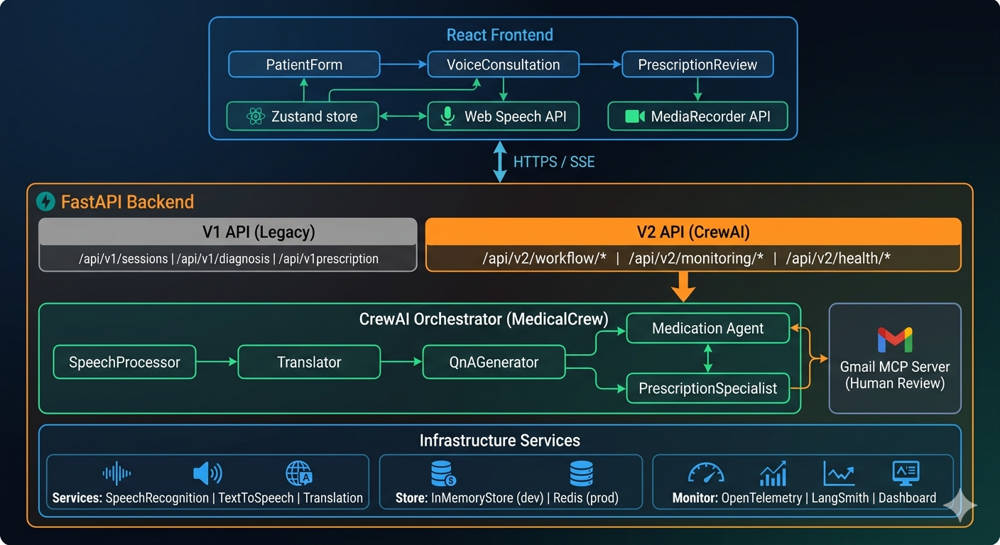
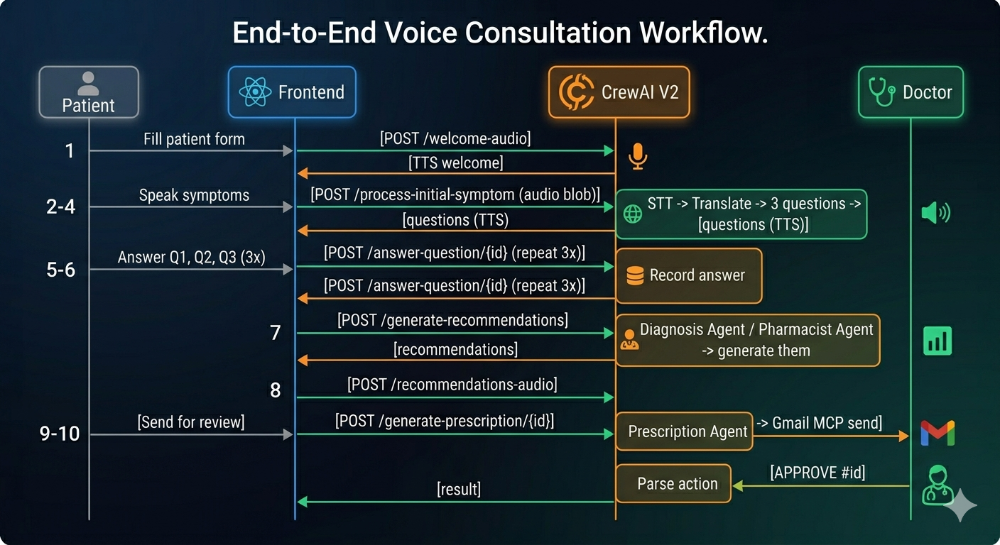

# DocJarvis- AI Medical Assistant

> **Medical Disclaimer:** DocJarvis is an AI-assisted tool for **educational (informational) purposes only**. It does not constitute medical advice, diagnosis, or treatment. Always consult qualified healthcare professional.

DocJarvis is a multilingual, voice-first medical consultation assistant built on **CrewAI mulit-agent architecture**. It takes a patient through symptom collection, AI-driven diagnosis, medical recommendations, and prescription generation- with a **Human-In-The-Loop** (HITL) doctor review step implemented via GMail MCP (Model Context Protocol) before any prescription is finalised.

## Table of Contents

- [Architecture Overview](#architecture-overview)
- [Multi-Agent System](#multi-agent-system)
- [Tech Stack](#tech-stack)
- [Project Structure](#project-structure)
- [API Reference](#api-reference)
- [Getting Started](#getting-started)
  - [Prerequisites](#prerequisites)
  - [Environment Variables](#environment-variables)
  - [Local Development](#local-development)
  - [Docker Compose](#docker-compose)
- [Workflow: End-to-End Flow](#workflow-end-to-end-flow)
- [MCP Integration](#mcp-integration)
- [Monitoring & Observability](#monitoring--observability)
- [CI/CD](#cicd)
- [Configuration Reference](#configuration-reference)
- [Deployment](#deployment-steps)

## Architecture Overview



The system has two parallel API tracks:

- **V1**- single-agent, stateless endpoints for simple integrations and the legacy frontend flow
- **V2**- the full multi-agent workflow. All new development targets V2.

## Multi-agent System

The V2 pipeline uses five **CrewAI agents**, each with a dedicated tool set and a scoped role:

| Agent                     | Role                                                      | Tools                                                      | Step(s) |
| ------------------------- | --------------------------------------------------------- | ---------------------------------------------------------- | ------- |
| `speech_processor`        | Transcribes audio and synthesises TTS responses           | `SpeechToTextTool`, `TextToSpeechTool`                     | 2, 8    |
| `translator`              | Translates between patient language and English           | `TranslationTool`                                          | 3, 4    |
| `qna_generator`           | Generates exactly 3 focused diagnostic questions          | `QuestionGenerationTool`                                   | 4       |
| `medication`              | Produces evidence-based medication recommendations        | `MedicationTool`                                           | 7       |
| `prescription_specialist` | Generates prescriptions and manages Gmail MCP review loop | `PrescriptionTool`, `GMailMCPSendTool`, `GMailMCPReadTool` | 9, 10   |

Agents are pre-inistantiated module-level singletons (`medical_agents.py`) and loaded into `MedicalCrew` at startup. The crew validates configuration during the FastAPI lifespan and logs a warning (without blocking startup) if initialisation fails.

**Agent Tools**

All agent tools inherit from CrewAI's `BaseTool` because FastAPI runs in an async event loop and CrewAI tools call `_run()` synchronously, async service calls (LLMs, TTS) are dispatched to a dedicated `ThreadPoolExecutor` via a `_run_async()` helper to avoid `RuntimeError: This event loop is already running`

## Tech Stack

**Backend**

| Component            | Technology                                           |
| -------------------- | ---------------------------------------------------- |
| Framework            | FastAPI 0.100+ with async lifespan                   |
| LLM                  | Google Gemini 2.5 Flash via `langchain-google-genai` |
| Agent orchestration  | CrewAI                                               |
| STT                  | Google Speech Recognition (`speech_recognition`)     |
| TTS                  | Google TTS (`gTTS`) + `pydub` for format conversion  |
| Translation          | `deep-translator` (GoogleTranslator) + `langdetect`  |
| Session store (dev)  | In-memory dict                                       |
| Session store (prod) | Redis (`redis-py` async)                             |
| Tracing              | OpenTelemetry (OTLP gRPC exporter)                   |
| LLM tracing          | LangSmith                                            |
| MCP                  | Gmail MCP server (custom `GMailMCPClient`)           |
| Config               | Pydantic Settings v2                                 |
| Runtime              | Python 3.11, Uvicorn                                 |

**Frontend**

| Component       | Technology                                       |
| --------------- | ------------------------------------------------ |
| Framework       | React 19 + TypeScript 5.5                        |
| Build           | Vite 7                                           |
| State           | Zustand 5 with `devtools` + `persist` middleware |
| Styling         | Tailwind CSS 3.4                                 |
| Audio capture   | `MediaRecorder` API (WebM/Opus → server STT)     |
| STT (Q&A phase) | Web Speech Recognition API                       |
| TTS (intro)     | Web Speech Synthesis API                         |
| HTTP            | Fetch API (custom `V1ApiClient` / `V2ApiClient`) |
| Testing         | Vitest + Testing Library                         |

## Infrastructure

| Component        | Technology                               |
| ---------------- | ---------------------------------------- |
| Reverse proxy    | Nginx (TLS 1.2/1.3, HTTP/2, SSE support) |
| Containerisation | Docker + Docker Compose                  |
| CI               | GitHub Actions                           |
| Metrics / traces | OpenTelemetry Collector → OTLP endpoint  |

## Project Structure

```
docjarvis/
├── backend/                      # Python FastAPI backend
│   ├── src/
│   │   ├── api/
│   │   │   ├── __init__.py
│   │   │   ├── main.py          # FastAPI app (artifact above)
│   │   │   ├── schemas.py
│   │   │   ├── routes/
│   │   │   │   ├── __init__.py
│   │   │   │   ├── diagnosis.py
│   │   │   │   ├── health_checks.py
│   │   │   │   ├── helpers.py
│   │   │   │   ├── monitoring.py
│   │   │   │   ├── prescription.py
│   │   │   │   ├── sessions.py
│   │   │   │   ├── workflow_routes.py
│   │   │   └── middleware/
│   │   │   │   ├── __init__.py
│   │   │   │   ├── error_handler.py
│   │   │   │   └── logging.py
│   │   ├── config/
│   │   │   ├── __init__.py
│   │   │   ├── monitoring.py
│   │   │   ├── settings.py
│   │   ├── core/
│   │   │   ├── __init__.py
│   │   │   ├── diagnosis.py
│   │   │   ├── llm_manager.py
│   │   │   ├── mcp_client.py
│   │   │   ├── prescription.py
│   │   │   ├── crew_ai/
│   │   │   │   ├── tools/
│   │   │   │   │   ├── __init__.py
│   │   │   │   │   ├── gmail_mcp_tools.py
│   │   │   │   │   ├── medical_tools.py
│   │   │   │   ├── workflows/
│   │   │   │   │   ├── __init__.py
│   │   │   │   │   ├── mcp_workflow.py
│   │   │   │   │   └── session_workflow.py
│   │   │   │   ├── __init__.py
│   │   │   │   ├── constants.py
│   │   │   │   ├── medical_agents.py
│   │   │   │   └── medical_crew.py
│   │   ├── monitoring/
│   │   │   ├── __init__.py
│   │   │   ├── cache_manager.py
│   │   │   ├── dashboard.py
│   │   │   ├── load_balancer.py
│   │   │   ├── performance_monitor.py
│   │   ├── services/
│   │   │   ├── __init__.py
│   │   │   ├── session_store.py
│   │   │   ├── speech.py
│   │   │   ├── translation.py
│   │   ├── utils/
│   │   │   ├── __init__.py
│   │   │   ├── backstories.py
│   │   │   ├── consts.py
│   │   │   ├── exceptions.py
│   │   │   ├── file_handler.py
│   │   │   ├── helpers.py
│   │   │   └── task_descriptions.py
│   ├── tests/
│   │   ├── conftest.py
│   │   ├── integration/
│   │   │   ├── test_monitoring_health.py
│   │   │   ├── test_session_lifecycle.py
│   │   │   ├── test_sessions_api.py
│   │   │   └── test_workflow_routes.py
│   │   └── unit/
│   │   │   ├── test_cache_manager.py
│   │   │   ├── test_consts.py
│   │   │   ├── test_diagnosis.py
│   │   │   ├── test_helpers.py
│   │   │   ├── test_mcp_workflow.py
│   │   │   ├── test_monitoring.py
│   │   │   ├── test_session_store.py
│   │   │   └── test_session_workflow.py
│   ├── pyproject.toml
│   ├── requirements.txt
│   └── Dockerfile
├── frontend/                     # React TypeScript frontend
│   ├── src/
│   │   ├── api/
│   │   │   ├── client.ts        # API client
│   │   ├── components/
│   │   │   ├── consultation/
│   │   │   │   ├── index.ts
│   │   │   │   ├── ConversationDisplay.tsx
│   │   │   │   ├── ConversationPane.tsx
│   │   │   │   ├── PatientForm.tsx
│   │   │   │   ├── PrescriptionPane.tsx
│   │   │   │   ├── PrescriptionReview.tsx
│   │   │   │   ├── VoiceConsultation.tsx
│   │   │   ├── layout/
│   │   │   │   ├── index.ts
│   │   │   │   ├── Header.tsx
│   │   │   │   ├── Footer.tsx
│   │   │   ├── speech/
│   │   │   │   ├── index.ts
│   │   │   │   ├── SpeechControls.tsx
│   │   │   │   ├── VoiceInput.tsx
│   │   │   └── ui/ # Reusable UI components
│   │   │   │   ├── index.ts
│   │   │   │   ├── Alert.tsx
│   │   │   │   ├── Button.tsx
│   │   │   │   ├── Card.tsx
│   │   │   │   ├── Input.tsx
│   │   │   │   ├── ProgressBar.tsx
│   │   │   │   ├── Select.tsx
│   │   │   │   ├── Spinner.tsx
│   │   │   │   └── TextArea.tsx
│   │   ├── hooks/
│   │   │   ├── index.ts
│   │   │   ├── useAudioRecording.ts
│   │   │   ├── useLocalStorage.ts
│   │   │   ├── useSpeechRecognition.ts
│   │   │   ├── useSpeechSynthesis.ts
│   │   ├── utils/
│   │   │   ├── constants.ts
│   │   │   ├── consultationStore.ts
│   │   │   └── index.ts
│   │   ├── App.tsx
│   │   ├── main.tsx
│   │   └── index.css
│   ├── public/
│   ├── Dockerfile
│   ├── env.d.ts
│   ├── index.html
│   ├── nginx.conf
│   ├── package.json
|   ├── package-lock.json
│   ├── tailwind.config.js
│   ├── tsconfig.json
│   ├── tsconfig.node.json
│   └── vite.config.ts
├── .github/
│   └── workflows/
│       ├── ci.yml
│       └── deploy.yml
├── .gitignore
├── .pylintrc
├── Pytest.ini
├── docker-compose.yml
├── otel-config.yml
├── package.json
└── README.md
```

## API Reference

Full interactive docs are available at `http://localhost:8000/docs` in debug mode.

### V1 — Legacy Single-Agent

| Method   | Endpoint                                | Description                            |
| -------- | --------------------------------------- | -------------------------------------- |
| `POST`   | `/api/v1/sessions/`                     | Create a session                       |
| `GET`    | `/api/v1/sessions/{id}`                 | Get full session state                 |
| `POST`   | `/api/v1/sessions/{id}/answer`          | Submit a text answer                   |
| `POST`   | `/api/v1/sessions/{id}/transcribe`      | Submit audio (STT + next question)     |
| `POST`   | `/api/v1/sessions/{id}/complete`        | Complete session and get medication    |
| `POST`   | `/api/v1/sessions/{id}/complete/stream` | Streaming medication (SSE)             |
| `DELETE` | `/api/v1/sessions/{id}`                 | Delete session                         |
| `POST`   | `/api/v1/diagnosis/questions`           | Generate questions from complaint text |
| `POST`   | `/api/v1/prescription/{id}/generate`    | Generate prescription document         |
| `GET`    | `/api/v1/prescription/{id}/download`    | Download prescription file             |

### V2 — CrewAI Multi-Agent Workflow

All V2 workflow endpoints accept `multipart/form-data` (FastAPI `Form` parameters).

| Method   | Endpoint                                         | Step | Description                                |
| -------- | ------------------------------------------------ | ---- | ------------------------------------------ |
| `POST`   | `/api/v2/workflow/welcome-audio`                 | 1    | Generate TTS welcome audio                 |
| `POST`   | `/api/v2/workflow/process-initial-symptom`       | 2–4  | STT → translation → 3 diagnostic questions |
| `POST`   | `/api/v2/workflow/answer-question/{id}`          | 5–6  | Record a Q&A answer                        |
| `POST`   | `/api/v2/workflow/generate-recommendations/{id}` | 7    | CrewAI diagnosis + pharmacist agents       |
| `POST`   | `/api/v2/workflow/recommendations-audio`         | 8    | TTS of recommendations                     |
| `POST`   | `/api/v2/workflow/generate-prescription/{id}`    | 9–10 | Generate PDF + Gmail MCP send              |
| `POST`   | `/api/v2/workflow/doctor-response`               | MCP  | Parse doctor's APPROVE/MODIFY/REJECT reply |
| `GET`    | `/api/v2/workflow/session/{id}/status`           | —    | Poll session progress                      |
| `DELETE` | `/api/v2/workflow/session/{id}`                  | —    | Delete session                             |
| `GET`    | `/api/v2/workflow/health`                        | —    | Crew health check                          |

### V2 — Monitoring

| Method | Endpoint                                 | Description                             |
| ------ | ---------------------------------------- | --------------------------------------- |
| `GET`  | `/api/v2/monitoring/dashboard`           | Full metrics dashboard                  |
| `GET`  | `/api/v2/monitoring/performance`         | Agent P50/P95/P99 latency + error rates |
| `GET`  | `/api/v2/monitoring/cache`               | Cache hit rate and per-agent config     |
| `POST` | `/api/v2/monitoring/cache/clear`         | Clear all agent caches                  |
| `POST` | `/api/v2/monitoring/cache/clear/{agent}` | Clear single agent cache                |
| `GET`  | `/api/v2/monitoring/load-balancing`      | Concurrency load per agent              |
| `GET`  | `/api/v2/monitoring/agents`              | Per-agent health status                 |
| `GET`  | `/api/v2/monitoring/health`              | Overall system health score             |

### V2 — Health

| Method | Endpoint                 | Description                                                  |
| ------ | ------------------------ | ------------------------------------------------------------ |
| `GET`  | `/api/v2/health/ready`   | Kubernetes readiness probe (LLM, crew, cache, load balancer) |
| `GET`  | `/api/v2/health/deep`    | Full diagnostic: agents, resources, MCP                      |
| `GET`  | `/api/v2/health/startup` | Post-init startup check                                      |
| `GET`  | `/health`                | Root health (used by load balancer)                          |
| `GET`  | `/ready`                 | Root readiness (used by load balancer)                       |

## Getting Started

### Prerequisites

| Requirement             | Version |
| ----------------------- | ------- |
| Python                  | 3.11+   |
| Node.js                 | 20+     |
| Docker + Docker Compose | 24+     |
| Google Cloud account    | —       |
| Gmail account (for MCP) | —       |

### Environment Variables

Create `.env` in project root from the template below:

```env
# -- LLM -------------------------
GOOGLE_API_KEY=your_google_api_key
# -- Application -------------------------
ENVIRONMENT=dev # dev | staging | prod
# -- Session Store -------------------------
# Leave blank to use in-memory store (dev).
# Set to redis://... for production
REDIS_URL=
# -- MCP / GMail -------------------------
# Gmail MCP server endpoint (e.g. a locally running MCP server or hosted URL)
GMAIL_SERVER=http://localhost:3001
# -- Doctor's email address for prescription review -------------------------
DOCTOR_EMAIL = doctor@hospital.com
# -- LangSmith (optional) -------------------------
LANGSMITH_API_KEY=
LANGSMITH_PROJECT=docjarvis
LANGSMITH_TRACING=false
# -- OpenTelemetry (optional) -------------------------
OTEL_ENABLED=false
OTEL_EXPORTER_ENDPOINT=http://local-host:4317
OTEL_SERVICE_NAME=docjarvis-backend
VITE_API_URL_v1=http://localhost:8000/api/v1
VITE_API_URL_v2=http://localhost:8000/api/v2
```

### Local Development

**Backend**:

```bash
cd backend
python -m venv .venv
source .venv/bin/activate          # Windows: .venv\Scripts\activate
pip install -r requirements.txt
uvicorn src.api.main:app --reload --host 0.0.0.0 --port 8000
```

The API will be live at `http://localhost:8000`. Swagger UI is available at `http://localhost:8000/docs` (debug mode only).

**Frontend**:

The Vite dev server requires a local TLS certificate because `MediaRecorder` and Web Speech APIs require HTTPS (even on localhost in some browsers). Generate one with [mkcert](https://github.com/FiloSottile/mkcert):

```bash
mkcert -install
mkcert localhost
# Moves the generated files into the frontend directory:
mv localhost.pem localhost-key.pem frontend/
cd frontend
npm install
npm run dev
```

### Docker Compose

```bash
# Build and start all services
docker compose up --build

# Backend only
docker compose up backend

# With Redis session store
REDIS_URL=redis://redis:6379 docker compose up
```

Services:

| Service    | Port   | Description                  |
| ---------- | ------ | ---------------------------- |
| `backend`  | `8000` | FastAPI app                  |
| `frontend` | `443`  | Nginx + React (HTTPS)        |
| `redis`    | `6379` | Session store (prod profile) |

## Workflow: End-to-End Flow



## MCP Integration

DocJarvis implements a HITL review step using the Gmail MCP server. No prescription is finalised without explicit doctor approval.

**How it works**

1. The `prescription_specialist` CrewAI agent calls `GMailMCPSendTool` to send a formatted HTML email to `DOCTOR_EMAIL` containing the prescription and review instructions.
2. The email body contains structured commands the doctor replies with:
   - `APPROVE #<review_id>`- approve as written
   - `MODIFY #<review_id> - <changes>`- approve with modifications
   - `REJECT #<review_id> - <reason>`- reject
3. The `MCPWorkflowManager` polls GMail via `GMailMCPReadTool` every 10 seconds for replies (configure via `POLL_INTERVAL_SECONDS`).
4. On receipt, `_parse_action()` uses regex matching to extract the command and routes to appropriate outcome handlers.
5. The frontend `PrescriptionReview` component lets users paste the doctor's reply directly as a fallback for environments where polling is unavailable.

**MCP server setup**

The GMail MCP server must be running and accessible at `GMAIL_SERVER`. Refer to MCP server's own documentation for OAuth2 credential setup. The `GMailMCPClient` connects on first use and reconnects if disconnected.

## Monitoring and Observability

### OpenTelemetry

When `OTEL_ENABLED=true`, the backend exports traces and metrics via OTLP gRPC to `OTEL_EXPORTER_ENDPOINT`. FastAPI and HTTPX are auto-instrumented via `FastAPIInstrumentor` and `HTTPXClientInstrumentor`. Custom metrics recorded:

| Metric                        | Type           | Description                 |
| ----------------------------- | -------------- | --------------------------- |
| `docjarvis.session.created`   | Counter        | Sessions created            |
| `docjarvis.session.completed` | Counter        | Sessions completed          |
| `docjarvis.llm.requests`      | Counter        | LLM API calls               |
| `docjarvis.llm.errors`        | Counter        | LLM API errors              |
| `docjarvis.llm.latency`       | Histogram (ms) | LLM request latency         |
| `docjarvis.session.duration`  | Histogram (s)  | Consultation duration       |
| `agent_execution_duration`    | Histogram (ms) | Per-agent execution time    |
| `cache_operations`            | Counter        | Cache hits / misses / sets  |
| `agent_concurrent_load`       | Histogram      | Real-time agent concurrency |

### LangSmith

Set `LANGSMITH_TRACING=true` and provide `LANGSMITH_API_KEY` + `LANGSMITH_PROJECT` to trace all LangChain/LLM calls in the LangSmith dashboard.

### Monitoring Dashboard

The V2 dashboard endpoint (`GET /api/v2/monitoring/dashboard`) returns a comprehensive JSON payload covering:

- Per-agent performance (P50/P95/P99, success rate, error count)
- Cache statistics (hit rate, LRU eviction count, per-agent TTL config)
- Load balancer state (current concurrency, queue depth per agent)
- System metrics (CPU, memory, disk via `psutil`)

### Per-Agent Thresholds

| Agent          | Latency threshold | Error rate threshold |
| -------------- | ----------------- | -------------------- |
| `stt`          | 3,000 ms          | 3%                   |
| `translation`  | 2,000 ms          | 2%                   |
| `qa`           | 4,000 ms          | 5%                   |
| `diagnosis`    | 6,000 ms          | 5%                   |
| `prescription` | 5,000 ms          | 5%                   |
| `tts`          | 4,000 ms          | 3%                   |

Breaches trigger a `performance_alerts` counter increment and a `WARNING` log entry.

## CI/CD

The pipeline is defined in `.github/workflows/ci.yml` and runs on every push to `main` and on pull requests targetting `main`.

```
backend-test ──┐
               ├──▶ docker-build
frontend-test ─┘
```

**`backend-test`:**

1. Python 3.11 setup with pip cache
2. Install `requirements.txt` + `pytest pytest-asyncio pytest-cov pylint httpx`
3. Pylint lint (non-blocking)
4. `pytest --cov=src --cov-report=xml`
5. Upload coverage to Codecov
   **`frontend-test`:**
6. Node 20 setup with npm cache
7. `npm ci`
8. ESLint + TypeScript typecheck
9. Vitest with coverage
10. `vite build` (validates the production bundle)
    **`docker-build`** (runs only after both test jobs pass):
11. `docker build ./backend`
12. `docker build ./frontend`

## Configuration Reference

All backend configuration is managed through `src/config/settings.py` (Pydantic Settings v2). Values are read from environment variables or `.env`

| Variable                 | Default            | Description                                       |
| ------------------------ | ------------------ | ------------------------------------------------- |
| `GOOGLE_API_KEY`         | —                  | **Required.** Google Generative AI API key        |
| `ENVIRONMENT`            | `dev`              | `dev` \| `staging` \| `prod`                      |
| `DEBUG`                  | `true`             | Enables Swagger UI at `/docs`                     |
| `HOST`                   | `0.0.0.0`          | Bind address                                      |
| `PORT`                   | `8000`             | Bind port                                         |
| `WORKERS`                | `4`                | Uvicorn workers (ignored in debug mode)           |
| `GEMINI_MODEL`           | `gemini-2.5-flash` | Model identifier                                  |
| `LLM_TEMPERATURE`        | `0.2`              | Generation temperature                            |
| `LLM_MAX_TOKENS`         | `2048`             | Max output tokens                                 |
| `REDIS_URL`              | `""`               | Redis connection string (empty = in-memory store) |
| `SESSION_TTL`            | `3600`             | Redis session TTL in seconds                      |
| `GMAIL_SERVER`           | `""`               | Gmail MCP server endpoint                         |
| `DOCTOR_EMAIL`           | `""`               | Recipient for prescription review emails          |
| `LANGSMITH_API_KEY`      | `""`               | LangSmith API key                                 |
| `LANGSMITH_PROJECT`      | `""`               | LangSmith project name                            |
| `LANGSMITH_TRACING`      | `false`            | Enable LangSmith tracing                          |
| `OTEL_ENABLED`           | `false`            | Enable OpenTelemetry export                       |
| `OTEL_SERVICE_NAME`      | `""`               | OTel service name                                 |
| `OTEL_EXPORTER_ENDPOINT` | `""`               | OTLP gRPC endpoint                                |

## Deployment

### Steps

```bash
# From repo root
gcloud auth login

gcloud iam service-accounts create docjarvis-deployer \
  --display-name="DocJarvis CD Deployer"

# Grant required roles
gcloud projects add-iam-policy-binding YOUR_PROJECT_ID \
  --member="serviceAccount:docjarvis-deployer@YOUR_PROJECT_ID.iam.gserviceaccount.com" \
  --role="roles/run.admin"

gcloud projects add-iam-policy-binding YOUR_PROJECT_ID \
  --member="serviceAccount:docjarvis-deployer@YOUR_PROJECT_ID.iam.gserviceaccount.com" \
  --role="roles/storage.admin"

gcloud projects add-iam-policy-binding YOUR_PROJECT_ID \
  --member="serviceAccount:docjarvis-deployer@YOUR_PROJECT_ID.iam.gserviceaccount.com" \
  --role="roles/iam.serviceAccountUser"

# Download key → paste contents as GCP_SA_KEY secret in GitHub
gcloud iam service-accounts keys create sa-key.json \
  --iam-account=docjarvis-deployer@YOUR_PROJECT_ID.iam.gserviceaccount.com

cat sa-key.json  # copy this → GCP_SA_KEY GitHub secret
rm sa-key.json   # never commit this

gcloud auth configure-docker

gcloud config set project YOUR_PROJECT_ID

# Enable required APIs (one time)
gcloud services enable run.googleapis.com containerregistry.googleapis.com

# Build and push
docker build -t gcr.io/YOUR_PROJECT_ID/docjarvis-backend:latest ./backend
docker push gcr.io/YOUR_PROJECT_ID/docjarvis-backend:latest

# Deploy
gcloud run deploy docjarvis-backend \
  --image gcr.io/YOUR_PROJECT_ID/docjarvis-backend:latest \
  --platform managed \
  --region us-central1 \
  --allow-unauthenticated \
  --memory 2Gi \
  --cpu 2 \
  --timeout 300 \
  --concurrency 10 \
  --max-instances 1 \
  --port 8080 \
  --set-env-vars "ENVIRONMENT=prod,GOOGLE_API_KEY=your_key,DOCTOR_EMAIL=doctor@example.com,CREWAI_TRACING_ENABLED=false,CREWAI_DISABLE_TELEMETRY=true" \
  --set-env-vars "GMAIL_CREDENTIALS_B64=your_b64,GMAIL_TOKEN_B64=your_b64"

gcloud run services describe docjarvis-backend \
  --region us-central1 \
  --format 'value(status.url)'

VITE_API_URL_V1 = https://docjarvis-backend-xxxx-uc.a.run.app/api/v1 # copy this → VITE_API_URL_V1 GitHub secret
VITE_API_URL_V2 = https://docjarvis-backend-xxxx-uc.a.run.app/api/v2 # copy this → VITE_API_URL_V2 GitHub secret
```
